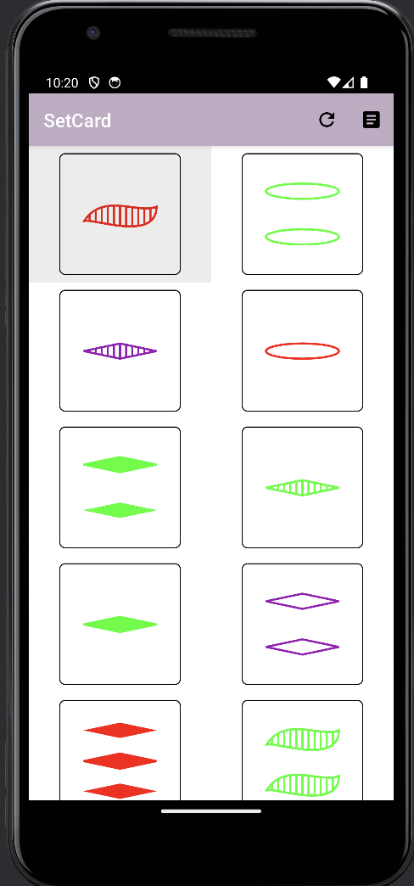

# setCard

Implement a [Set (card)](https://en.wikipedia.org/wiki/Set_(card_game)) game app.

## What is set card game?
The deck consists of 81 unique cards that vary in four features across three possibilities for each kind of feature: number of shapes (one, two, or three), shape (diamond, squiggle, oval), shading (solid, striped, or open), and color (red, green, or purple). Each possible combination of features (e.g. a card with three striped green diamonds) appears as a card precisely once in the deck. In the game, the following combinations of three cards are said to make up a set:

* They all have the same number or have three different numbers.
* They all have the same shape or have three different shapes.
* They all have the same shading or have three different shadings.
* They all have the same color or have three different colors

For example, these three cards form a set:
* One red striped diamond
* Two red solid diamonds
* Three red open diamonds
The player wins when all the sets are found.

## Screenshots
<figure class="half">
  
  
</figure>

## Opening a sample in Android Studio

Clone the repository:

```
git clone git@github.com:hsiangling0/setCard.git
```

